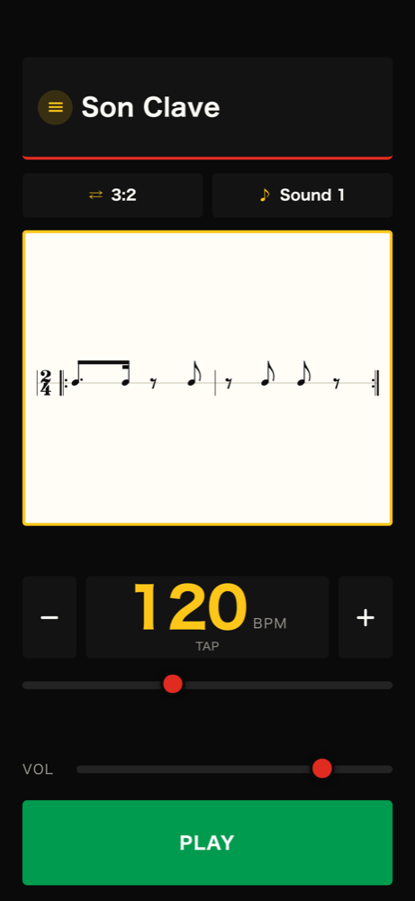
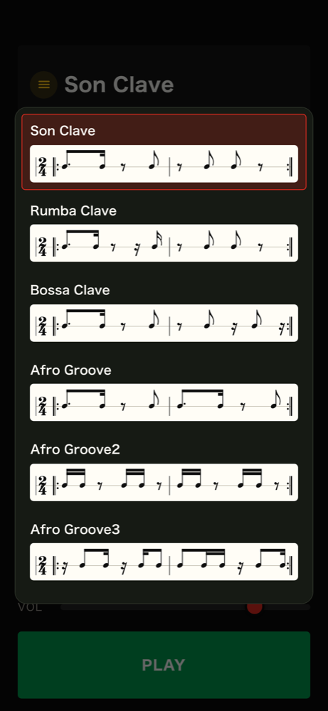
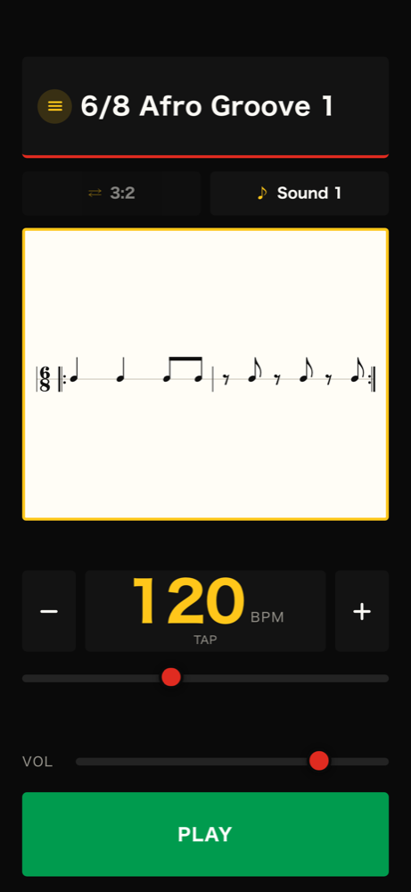
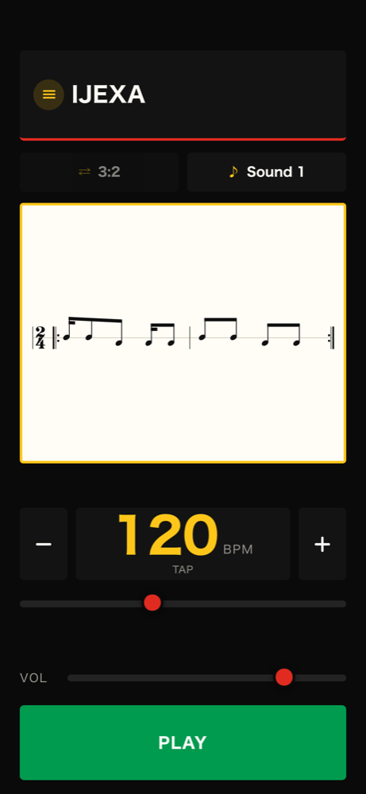
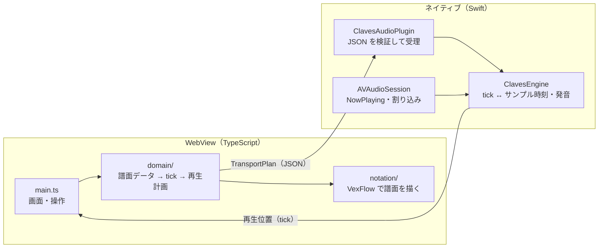

# Clavenome（クラベノーム）

> ラテンミュージックのリズムパターンを鳴らす、練習用メトロノーム（iOS）

[](https://apps.apple.com/jp/app/clavenome/id6813747522)


**App Store**: [Clavenome](https://apps.apple.com/jp/app/clavenome/id6813747522)（無料）

## はじめに

このリポジトリは、ポートフォリオとしても公開しています。企画・設計・実装・App Store 申請まで担当しています。

<div align="center">
  <video src="https://github.com/user-attachments/assets/690fbb7f-c2d7-4ea7-81a3-f3c34713c0d5" width="320" controls></video>
  <p>操作の様子（音が出ます）</p>
</div>

<table>
  <tr>
    <td align="center" width="25%"></td>
    <td align="center" width="25%"></td>
    <td align="center" width="25%"></td>
    <td align="center" width="25%"></td>
  </tr>
  <tr>
    <td align="center">譜面を見ながら再生</td>
    <td align="center">リズムを譜面で選ぶ</td>
    <td align="center">6/8 のリズム</td>
    <td align="center">様々なリズムが選択可能</td>
  </tr>
</table>

## 課題と解決

パーカッションの練習では、クラーベなどのリズムパターンを鳴らすメトロノームが使われます。ただ、既存のアプリは収録されているリズムの種類が少なく、アプリ自体の開発も止まっていました。練習したいリズムが今後追加される見込みもなかったため、自分で作ることにしました。

| 課題 | 解決したこと |
|---|---|
| 単なるクリックのメトロノームでは、クラーベ（ラテン音楽の骨格になるリズム）に合わせた練習ができませんでした | クラーベそのものを鳴らし、演奏者がそれを聴きながら自分のパートを重ねて練習できるようにしました |
| 既存のクラーベメトロノームは収録パターンが少なく、練習したいリズムが入っていませんでした | ソン・ルンバ・ボサや 6/8 のアフロ系のリズムを収録しました。譜面データを 1 ファイル足すだけで増やせる構造です |
| 耳だけではリズムの形を覚えにくく、今どこを鳴らしているのかも分かりませんでした | 譜面を表示し、再生位置をハイライトします |
| iOS は画面をロックすると WebView の JavaScript を止めるため、Web 技術だけでは練習中に音が止まります | 再生の時計を Swift のオーディオエンジンに置き、ロック中もサンプル単位の精度で鳴らし続けます |

## できること

- 収録リズム 9 種（Son / Rumba / Bossa Clave、Afro Groove 1〜3、6/8 Afro Groove 1〜2、IJEXA）
- クラーベの 3:2 / 2:3 切替
- 1 本線の譜面表示と、再生位置のハイライト
- 40〜240 BPM のスライダー、±1 ボタン（長押しで連続）、タップテンポ
- 音色 2 種（アゴゴ風・クラベス風。どちらも合成音）
- バックグラウンド再生、ロック画面からの再生・停止、イヤホン抜去で自動停止
- 通信ゼロ・アカウントなし・広告なし・無料

---

## 技術スタック

  

| カテゴリ | 技術 |
|---|---|
| 言語 | TypeScript 5 / Swift 5 |
| 譜面描画 | VexFlow 5（SVG） |
| ビルド | Vite 7 / pnpm 10 |
| iOS パッケージング | Capacitor 8（WKWebView ＋ 自作プラグイン） |
| 再生エンジン | AVAudioEngine / AVAudioSourceNode / AVAudioSession / MPNowPlayingInfoCenter |
| ブラウザ版の再生 | Web Audio API（開発時の確認用。ネイティブと同じ計画を再生する） |
| テスト | Vitest（288 件）/ XCTest（72 件）/ Playwright（E2E を Chromium と WebKit で実行・譜面の見た目の検証） |
| セキュリティ | CSP `default-src 'none'` / JS→ネイティブ境界の検証層 / pnpm のサプライチェーン設定 |
| AI 開発 | Claude Code（実装の補助。設計とルールは `CLAUDE.md` に自分で定義） |

## 技術選定の理由

<details>
<summary><strong>Capacitor — SwiftUI で全部書かず、WebView ＋ ネイティブの二層にした理由</strong></summary>

画面の中心は**譜面**です。連桁・休符・付点・リピート記号を正しく描けるライブラリは、Web には VexFlow がありますが、iOS ネイティブにはありません。そのため画面は WebView で作ることにしました。

ただし**再生の時計は WebView に置けません**。iOS は画面をロックすると WebView の JavaScript を止めるため、音が鳴らなくなります。そこで再生だけを Swift に置き、JS は「この計画で鳴らして」と渡すだけにしています。

Capacitor は、この「Web の画面 ＋ 自作のネイティブ機能」を最小の構成で組めるので選びました。プラグインは 1 クラス（`ClavesAudioPlugin`）だけです。ブラウザでもそのまま動くので、譜面の調整は開発サーバーですぐ確認できます。

</details>

<details>
<summary><strong>AVAudioSourceNode — AVAudioPlayer や タイマーではなく、サンプル単位で書く理由</strong></summary>

メトロノームは打点の間隔が揃っていることがすべてです。`Timer` で鳴らすと、メインスレッドの混み具合で数 ms〜数十 ms ずれます。

`AVAudioSourceNode` はオーディオスレッドから呼ばれ、**どのサンプルに打点を置くか**を自分で決められます。tick → 秒 → サンプル位置の式は JS（`src/domain/transport.ts`）と Swift（`Transport.swift`）で同じものを持ち、`golden/transport.json` で両側の結果が一致することをテストで確かめています。

音源は録音せず合成にしました。音源ファイルを持たずに済み、音色の切替も波形の表を差し替えるだけです。

</details>

<details>
<summary><strong>PPQ=96 の整数 tick — 秒や拍ではなく tick で時刻を持つ理由</strong></summary>

収録リズムには 2/4（16 分音符の刻み）と 6/8（8 分音符 3 つで 1 拍）が混ざっています。秒で持つとテンポを変えるたびに全打点を計算し直すことになり、拍で持つと 6/8 の 3 連が小数になります。

4 分音符を 96 tick にすると、16 分音符は 24、8 分 3 連は 32、付点 4 分は 144 と、すべて整数になります。テンポは「1 tick が何秒か」だけで決まり、打点の位置はテンポと切り離せます。整数なので JS と Swift のあいだで丸め誤差も出ません。

</details>

<details>
<summary><strong>VexFlow ＋ Playwright — jsdom のテストでは足りない理由</strong></summary>

VexFlow は描くときにブラウザの canvas で文字幅を測り、音符の位置を決めます。jsdom には canvas がないので、テスト環境では位置が実ブラウザと変わります。つまり**単体テストが通っても譜面が崩れていることがあります**。

そのため譜面の見た目は Playwright で実ブラウザを起動して確かめています（`scripts/check-notation.mjs`）。符尾が符頭から離れていないか、小節からはみ出していないか、符頭が読める大きさかを 9 リズム × 3 画面幅で自動判定し、スクリーンショットを残します。

</details>

<details>
<summary><strong>通信ゼロ — CSP と検証層で「外に出せない」構造にした理由</strong></summary>

このアプリはネットワークを使いません。方針として言うだけでなく、**依存パッケージが汚染されても外へ送れない**構造にしています。

- `index.html` の CSP を `default-src 'none'; connect-src 'self'` にし、fetch / XHR / WebSocket を自分の生成元に閉じています。外部スクリプト・外部フォント・分析 SDK は入れていません
- pnpm の `minimumReleaseAge`（公開から 7 日経つまで新バージョンを入れない）と `blockExoticSubdeps` で、汚染されたパッケージが入る窓を狭めています
- Apple のプライバシーマニフェストは「収集するデータなし」で、App Store の申告と一致させています

JS → ネイティブの境界も同じ考えで、WebView から届く再生計画を信用せず、サイズ・件数・範囲を検証してからオーディオスレッドに渡します（後述）。

</details>

<details>
<summary><strong>Claude Code — 実装の速度を上げるために使い、設計と判断は自分で行う</strong></summary>

設計方針（譜面データを唯一の真実源にする、再生の時計をネイティブに置く、通信をゼロにする）と、収録するリズムの選定・記譜の確認は自分で決めています。Claude Code はその方針のもとで、実装・テスト・調査の手を増やすために使っています。

判断を AI に委ねないために、`CLAUDE.md` に自分の決めたルールを書いています。「完了と言う前に通すコマンド」「譜面を変えたら実ブラウザで見る」「拍子を変えたら 1 拍の長さも変える」など、過去に自分が踏んだ落とし穴をルールにして、同じ失敗を繰り返さないようにしています。

</details>

---

## アーキテクチャ

### 全体図



### データの流れ

```
譜面データ（registry.ts）
  │  音価と休符の列。唯一の真実源
  ▼
再生計画 TransportPlan
  │  { bpm, bpmUnit, cycleTicks, events: [{tick, pitch}] }
  │  JS と Swift が共有する契約。golden fixture で両側を固定
  ▼
ClavesAudioPlugin（Swift）
  │  サイズ・件数・範囲を検証。通らなければ reject して JS に理由を返す
  ▼
ClavesEngine（Swift）
     オーディオスレッドで tick → サンプル位置に変換し、波形を書く
```

---

## アーキテクチャ設計

### 譜面データが唯一の真実源

リズムは `src/domain/patterns/` に音価と休符の列として書き、再生イベントはそこから作ります。逆向き（打点の間隔から音価と休符を復元する）は一意に決まらないので実装していません。譜面と音が別々のデータを持たないので、ずれません。

新しいリズムは、パターンを 1 ファイル書いて `registry.ts` に登録するだけで増やせます。小節の長さが合わない、拍の境目をまたぐ音価、未知の音高はバリデータが弾きます。

### 時計はネイティブが持ち、JS は計画を渡すだけ

JS は「いつ鳴らすか」を計算しません。ユーザー操作を `TransportPlan` に変換して Swift に渡し、Swift が自分の時計で鳴らします。譜面のハイライトに使う再生位置も、ネイティブに聞いて描きます（JS 側で別に数えると必ずずれるため）。

tick ↔ 時刻の式は `src/domain/transport.ts` と `ios/ClavesEngine/Sources/ClavesEngine/Transport.swift` に同じものを書き、`golden/` の入出力で両側をテストしています。片方だけ変えるとテストが落ちます。

### 切替は「予約済みの範囲より後の、最初の拍境界」から

再生エンジンは少し先まで音を予約しておきます。テンポやパターンを変えたとき、単に「次の拍境界」から効かせると、予約済みの範囲と重なって二重に鳴ります。予約を取り消す実装は複雑で、取りこぼしの原因になります。

そこで切替点は予約済みの範囲より後にしか置きません（`Scheduler.nextBoundaryTick`）。予約した音はそのまま鳴り終わり、新しい計画はその後の拍境界から始まります。取り消しが要らないので、二重発音も打点の欠落も起きません。

### JS → ネイティブの境界を信用しない

再生計画はオーディオスレッドが読みます。壊れた値が通ると、音が止まるか、最悪アプリごと落ちます。WebView の中身は書き換えられうる前提で、`PlanDecoder` / `PlanValidator` が境界を守ります。

- JSON を展開する**前に**サイズで打ち切る（64 KiB）。`JSONDecoder` は件数を数える前に配列を丸ごと展開するため
- `schemaVersion` と `ppq` の一致、打点数の上限、周期長の上限（整数オーバーフロー防止）、BPM の範囲、打点の最小間隔（周期の継ぎ目も含む）を検査
- 弾いたときは黙って無音にせず、理由を JS に返す

`abs(Int.min)` が落ちる、NaN との `min` / `max` が 1.0 を返す、といった検査自体が壊れる罠も潰しています。

### ライフサイクル

- 着信・Siri・アラームで中断したら止まり、**中断が終わっても自動で鳴り出さない**
- イヤホンを抜いたら止まる（スピーカーから大音量が出ない）。挿したときは止まらない
- ロック画面の再生・停止はネイティブが受け、JS に通知して画面のボタンを同期する
- ネイティブの状態は main キューだけで触る。Capacitor の呼び出しと割り込み通知は別のスレッドで届くため、寄せ先を決めないと競合する

### 譜面の描画

VexFlow の 5 線譜を 1 本線として使い、2/4 と 6/8、リピート記号、再生位置のハイライトを描きます。段の幅は全パターン共通の固定値にし、リズムを切り替えても譜面の大きさが揃うようにしています。

描画前に音楽フォントの読み込みを待つ、グリフの `pt` を viewBox の単位に直す、余白を実測して viewBox を詰める、といった調整は、すべて実ブラウザ（`pnpm check:notation`）で確認しています。

## テスト戦略

守る対象ごとに、確かめられる場所で確かめます。

| 層 | 道具 | 守るもの |
|---|---|---|
| 単体 | Vitest（288 件） | 譜面データの正しさ、tick 計算、先読みスケジューラ、状態機械。時間の振る舞いは偽のタイマーで確かめる |
| ネイティブ | XCTest（72 件） | 時刻計算・発音・検証層・割り込み時の判断。判断は純粋な関数に切り出し、実機なしで固定する |
| JS ⇄ Swift の契約 | golden fixture | 同じ入力に対して両側が同じ結果を返すこと。片方だけ変えると落ちる |
| E2E | Playwright ＋ `node:test` | 画面の操作（押す・離す・長押し・レイアウト）。**Chromium と WebKit の両方**で流す |
| 見た目 | Playwright（`check:notation`） | 符尾の離れ、小節からのはみ出し、符頭の大きさを 9 リズム × 3 画面幅で自動判定 |

WebKit でも流すのは、iPhone と同じ描画エンジンだからです。実際に、**iOS 18 以前の WebKit だけで一覧の譜面が縮む**不具合が出ました（`button` の既定値 `align-items: flex-start` が原因で、Chromium では再現しません）。E2E ではこの既定値を再現して、同じ不具合が戻らないようにしています。

## ディレクトリ構成

```
src/
├── domain/            # 型・tick 計算・連桁算出・バリデータ・再生計画の導出
│   ├── patterns/      #   収録リズム（1 ファイル 1 リズム）
│   ├── registry.ts    #   収録リズムの一覧。画面に出るのはここに載せたものだけ
│   └── transport.ts   #   tick ↔ 時刻の式。JS/Swift 共有の契約
├── audio/             # 先読みスケジューラ・状態機械・Web Audio 実装・ネイティブ接続
├── notation/          # VexFlow による譜面描画とレイアウト
└── main.ts            # 画面と操作

ios/
├── App/               # Capacitor の iOS アプリ本体
│   └── App/
│       ├── ClavesAudioPlugin.swift   # JS からの入口。JSON を検証して受理
│       └── ClavesAudioEngine.swift   # AVAudioEngine の組み立てとライフサイクル
└── ClavesEngine/      # 再生の中核（Swift Package）。時刻計算・発音・検証層。XCTest 72 件

golden/                # JS と Swift の両側で照合する入出力 fixture
e2e/                   # 画面操作の E2E（Playwright。Chromium と WebKit）
scripts/
├── check-notation.mjs     # 実ブラウザで譜面を検証（Playwright）
└── store-screenshots.mjs  # App Store 用スクリーンショット
```

---

## 開発

セットアップ・検証・iOS への反映の手順は [`docs/development.md`](docs/development.md) にまとめています。

---

© 2026 TANEBI CREATIVE

ソースコードは閲覧のために公開しています。複製・改変・再配布の許可は含みません。
